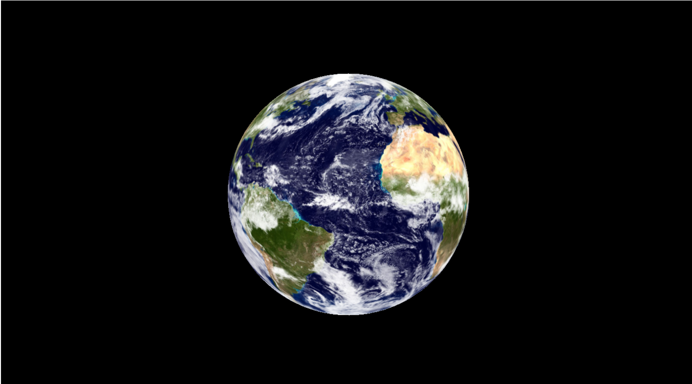

# CS52 Workshops: JS Graphics

[Three.js](https://threejs.org/) is a Javascript library that allows users to easily create and animate 3D models and graphics. It is built using WebGL which allows it to render graphics in most modern web browsers without extra plugins. It's commonly used in a lot of websites as seen in the presentation here <-- assuming there's a link to the presentation...

## Overview

In this workshop (a simplified version of [this tutorial](https://levelup.gitconnected.com/tutorial-build-an-interactive-virtual-globe-with-three-js-33cf7c2090cb)), we'll be going over some of the basics of three.js by creating a globe that you can rotate with your mouse. With this, you'll learn about creating some of the basic components in three.js such as a scene, camera, renderer, etc…



## Setup

Clone the repo and follow the instructions to get started.

```bash
git clone
npm install
npm start
```

## Getting Started

#### 1. Basic Html

Let’s start off with some basic html to get our site going. Create a new document and lets call it `index.html`. Below we are including the three.js library, this can also be done using your webpack and calling `yarn install three`.  Lets then declare a basic container where our project will live. 

 Your HTML file can look something like this:

```javascript
<html>
	<head>
		<title>It's a Large World</title>
	</head>
	<body>
		<script src="https://cdnjs.cloudflare.com/ajax/libs/three.js/91/three.min.js"></script>
    		<div id="container" width="100%" height="100%" />
		<script src="main.js"></script>
	</body>
</html>

</html>
```

#### 2. DOM Element

Let’s create another file in the same directory and call it `main.js`. This is where all of the code that makes up our 3D render will be going. To target the container we just made in our `index.html` we need to call the container in our `main.js` file below.

```javascript
const container = document.querySelector('#container');
```

## The 3D Render

A 3D render is made up of three things **scene**, **camera**, and **renderer**. These are three things are necessary to actually have anything displayed. The next steps involve instantiating these. 


#### 3. Create the Scene 

Let’s start off with the scene. Our 3D render needs a place to live right?

`const scene = new THREE.Scene();`

And add a black background:
`scene.background = new THREE.Color( 0x000 );`

#### 4. The Camera
We need to declare some variables that our camera is going to use!
``` javascript
const WIDTH = window.innerWidth;
const HEIGHT = window.innerHeight;
const FOV= 45; 
const ASPECT = WIDTH / HEIGHT;
const NEAR = 0.1;
const FAR = 10000;
```
What do these all mean??

* **FOV**: Field of vision is the amount of the scene that is displayed on the screen calculated in degrees.
* **Aspect**: Our aspect ratio should almost always be width of the window / height of the window so that we do not squished objects when viewing on different devices.
* **Near** and **Far**: These values affect the performance in determining what gets rendered. Objects farther from the camera than **far** won’t get rendered and objects closer than **near** will also not render.
Highly recommend you **play around with these** to understand what is going on.
Three.js has a Camera class, inherited by its various sub-classes such as PerspectiveCamera (the one we’ll be using) or OrthographicCamera. PerspectiveCamera is most commonly used for 3D scenes because it mimics how the human eye sees. There are many other types of cameras like an [ArrayCamera](https://threejs.org/docs/#api/cameras/ArrayCamera) that’s used for Virtual Reality. 

Instantiate the camera:

`const camera = new THREE.PerspectiveCamera(VIEW_ANGLE, ASPECT, NEAR, FAR);`

We’ll also set the camera’s position on the x, y, and z axes:

`camera.position.set( 0, 0, 500 );`

Finally we need to add the camera to the scene.

`scene.add(camera);`

#### 5. The WebGl Renderer

Finally the last necessary object, the renderer! 
WebGL (Web Graphics Library) renders interactive 2 and 3D graphics in the browser. This is what we will be creating and attaching to our HTML container `div`. 

`const renderer = new THREE.WebGLRenderer();`

Tell it that there is a container that needs rendering!
`container.appendChild(renderer.domElement);`

## Creating the Globe
Now we can move on to our globe!

#### 6. Create a sphere

Three.js uses geometric meshes to create primitive 3D shapes like spheres, cubes, cylinders, etc. Since I’m going for a planet Earth look, I’ll be using a sphere.

We’ll start by defining the sphere’s attributes:

``` javascript
const RADIUS = 200;
const SEGMENTS = 50;
const RINGS = 50;
```

Then, because we want to texture the sphere with an image of the Earth, we’re going to create a group that will hold our sphere and its texture meshed together:

``` javascript
const globe = new THREE.Group();
scene.add(globe);
```

And now, we’ll create our sphere and its texture, and mesh them together using three.js’s TextureLoader:

`var loader = new THREE.TextureLoader();`

We call the load method, which takes in our image url ([here’s the one we used](https://eoimages.gsfc.nasa.gov/images/imagerecords/57000/57735/land_ocean_ice_cloud_2048.jpg)) as the first argument, and a function that: 1) creates a sphere with the predefined attributes, 2) maps the texture to the material (read more here about materials in the three.js [docs](https://threejs.org/docs/index.html#manual/introduction/Creating-a-scene)), 3) creates a mesh of our sphere and the material, and 4) adds the mesh to our globe group.

``` javascript
loader.load( 'land_ocean_ice_cloud_2048.jpg', function ( texture ) {

  // Create the sphere
  var sphere = new THREE.SphereGeometry( RADIUS, SEGMENTS, RINGS );

  // Map the texture to the material. 
  var material = new THREE.MeshBasicMaterial( { map: texture, overdraw: 0.5 } );

  // Create a new mesh with sphere geometry.
  var mesh = new THREE.Mesh( sphere, material );

  // Add mesh to globe
  globe.add(mesh);
} );
```

Now that we have our sphere, let’s position it backwards (along the z axis) so that we can see it:

`globe.position.z = -300;`

#### 7. Add lighting

Since we used MeshBasicMaterial in the previous step (a material which is not affected by lighting), this next step is dispensable, but I we’re including it in this tutorial because it’s usually an important component of a 3D scene.

First we’ll create a point light (the library has several other types of light):

`const pointLight = new THREE.PointLight(0xFFFFFF);`

Now we set the light’s position:

``` javascript
pointLight.position.x = 10;
pointLight.position.y = 50;
pointLight.position.z = 400;
```

And then we add it to the scene:

`scene.add(pointLight);`

At this point, you should see a static globe if you open your HTML file in the browser. Let’s get to animating it!

## Creating the Animation

#### 8. Setup Animation Loop

First, we’re going to set up the update function for the built-in `requestAnimationFrame` to initially render our scene, and to re-render our scene after changes:

``` javascript
function update () {

  //Render:
  renderer.render(scene, camera);

  // Schedule the next frame:
  requestAnimationFrame(update);  
}

// Schedule the first frame:
requestAnimationFrame(update);
```

#### 9. Rotate on mouse movement

This is the best part, because it almost feels like you’re spinning the globe with your own hands when you’re controlling it with your mouse or trackpad.

To start, we’ll set up an array that stores our previous mouse position, with its start value being at the center of the page:

`var lastMove = [window.innerWidth/2, window.innerHeight/2];`

Next, we’ll define a listener function to fire when the mouse moves:

``` javascript
function rotateOnMouseMove(e) {
  e = e || window.event;

  //calculate difference between current and last mouse position
  const moveX = ( e.clientX - lastMove[0]);
  const moveY = ( e.clientY - lastMove[1]);
  //rotate the globe based on distance of mouse moves (x and y) 
  globe.rotation.y += ( moveX * .005);
  globe.rotation.x += ( moveY * .005);

  //store new position in lastMove
  lastMove[0] = e.clientX;
  lastMove[1] = e.clientY;
}
```

And finally, we define our event listener:

`document.addEventListener('mousemove', rotateOnMouseMove);`

And there you have it!

## Deployment

Finally, let’s deploy our beautiful animation to surge! :rocket: You’ve done this a million times by now but here are the steps in case you forgot…

* make sure you’re in the root directory (the same level as `index.html`) and type `surge`
* when prompted, choose your domain name (ex. `<YOUR DOMAIN>.surge.sh`)
* ta-da! :dancer:

### Extra Credit

Now that you know some basic three.js... go nuts! :squirrel:

Feel free to experiment with: 

* the sphere’s texture and image :first_quarter_moon_with_face: (see [here](http://flatplanet.sourceforge.net/maps/alien.html) for some flat planet images...)
* background :star2:
* animations (zooming, resizing…) :mag:
* adding new shapes: [Three Js Geometry](https://threejs.org/docs/index.html#api/core/Geometry)
* and so on :relaxed:

## What you Did

* [x] Instantiated a canvas, camera, renderer
* [x] Created a basic object using the geometry class
* [x] Added a point light object to shine on the 3D object
* [x] Learned how to animate the 3D object
* [x] Introduced to some of the mechanics behind movement
* [ ] Created your own 3D object

## To Submit on Canvas


* [x] The surge URL for your sphere animation site

## Additional Resources

* [Reference Tutorial for this Workshop](https://levelup.gitconnected.com/tutorial-build-an-interactive-virtual-globe-with-three-js-33cf7c2090cb)
* [Aerotwist Tutorial](https://aerotwist.com/tutorials/getting-started-with-three-js/)
* [Another Tutorial](https://codepen.io/natacoops/post/sugar-sugar-threejs-project-walkthrough)
* [threejs.org](https://threejs.org/) 

Check out some of these websites!
